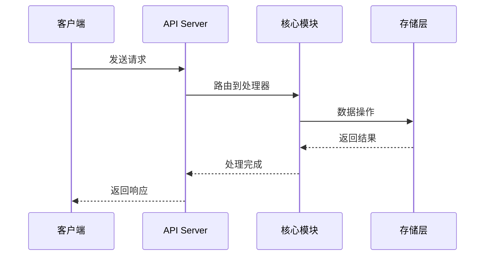
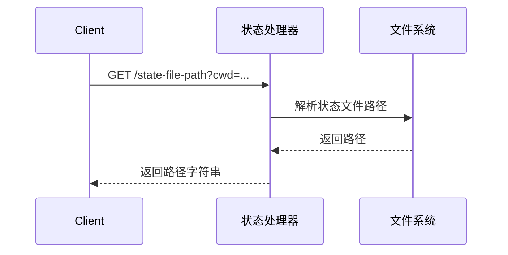
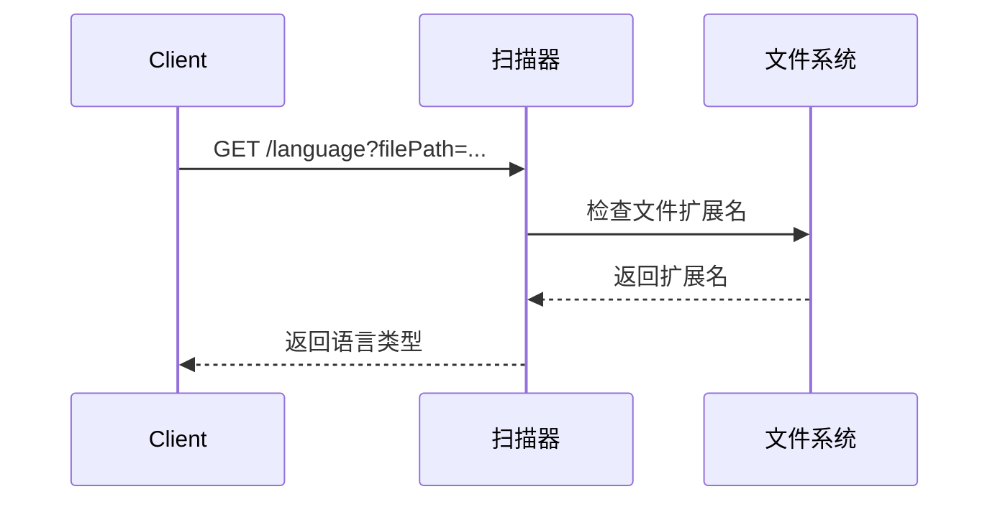
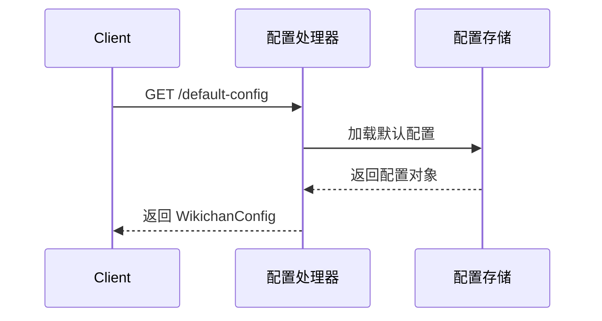
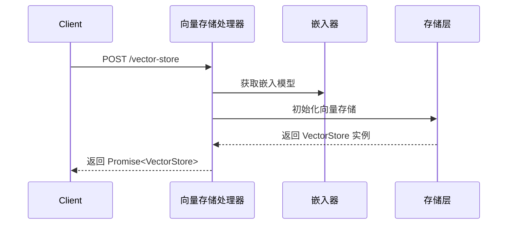
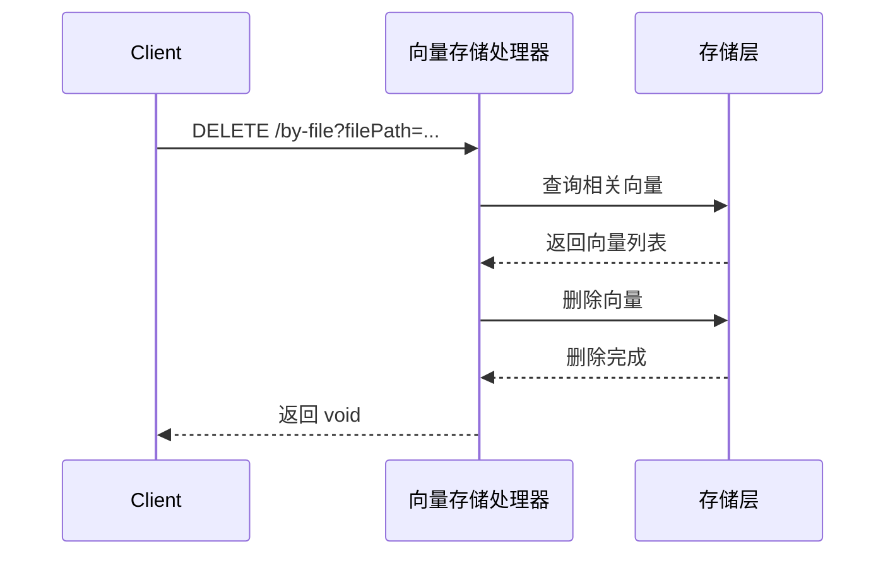
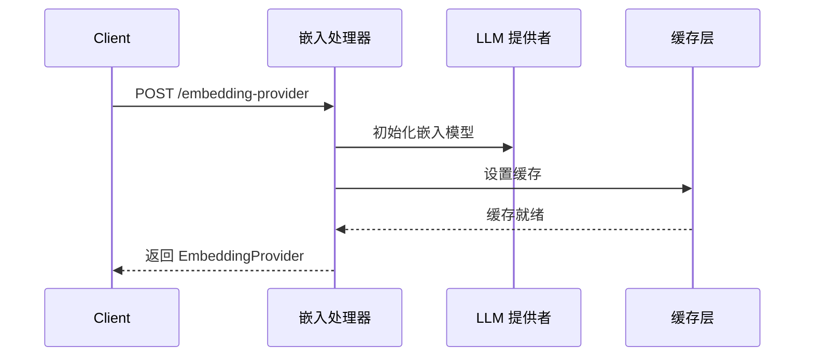
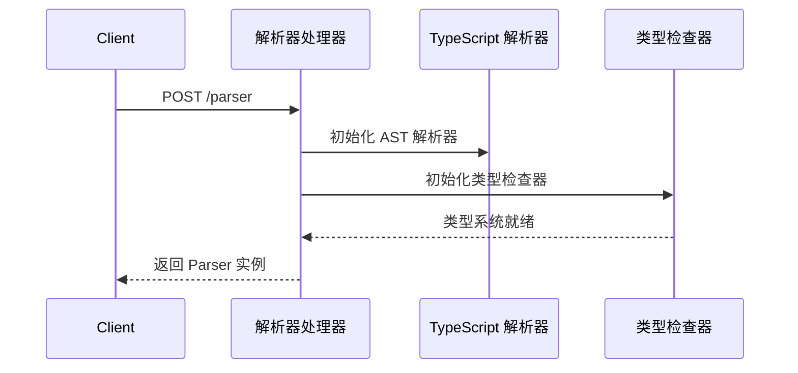
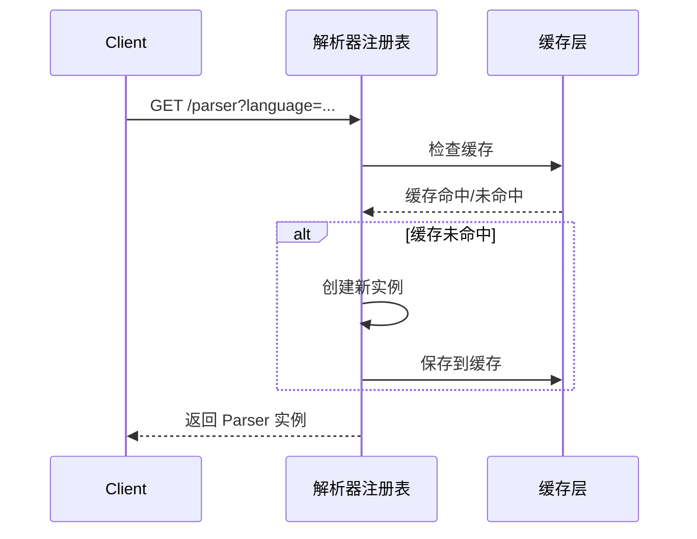

<cite>

**本文引用的文件**

| 文件路径 | 说明 |
|---------|------|
| src/core/state.ts | 状态管理模块 |
| src/core/scanner.ts | 文件扫描和语言检测模块 |
| src/core/config.ts | 配置管理模块 |
| src/core/rag/vectorStore.ts | RAG 向量存储模块 |
| src/core/rag/embedder.ts | RAG 嵌入提供者模块 |
| src/core/parser/tsParser.ts | TypeScript 解析器模块 |
| src/core/parser/pyParser.ts | Python 解析器模块 |
| src/core/parser/index.ts | 解析器索引模块 |
| src/core/llm/client.ts | LLM 客户端模块 |
| src/core/indexer/graph.ts | 依赖图模块 |
| src/core/incremental/impact.ts | 增量影响分析模块 |
| src/core/incremental/gitDiff.ts | Git 差异分析模块 |
| src/core/generator/apiDoc.ts | API 文档生成模块 |

</cite>

## 目录

- [概述](#概述)
- [API 端点总览](#api-端点总览)
- [状态管理](#状态管理)
  - [GET /state-file-path](#get-state-file-path)
- [语言检测](#语言检测)
  - [GET /language](#get-language)
- [配置管理](#配置管理)
  - [GET /default-config](#get-default-config)
- [RAG 向量存储](#rag-向量存储)
  - [POST /vector-store](#post-vector-store)
  - [DELETE /by-file](#delete-by-file-向量存储)
- [RAG 嵌入提供者](#rag-嵌入提供者)
  - [POST /embedding-provider](#post-embedding-provider)
- [代码解析器](#代码解析器)
  - [POST /parser (TypeScript)](#post-parser-typescript)
  - [POST /parser (Python)](#post-parser-python)
  - [GET /parser](#get-parser)
- [LLM 客户端](#llm-客户端)
  - [POST /l-l-m-client](#post-l-l-m-client)
- [模块依赖图](#模块依赖图)
  - [GET /modules](#get-modules)
  - [GET /module-by-name](#get-module-by-name)
  - [GET /dependency-graph](#get-dependency-graph)
  - [GET /transitive-dependencies](#get-transitive-dependencies)
  - [GET /dependents](#get-dependents)
  - [GET /affected-documents](#get-affected-documents)
- [Git 变更分析](#git-变更分析)
  - [GET /changes](#get-changes)
  - [GET /current-commit](#get-current-commit)
- [API 端点检测](#api-端点检测)
  - [GET /path](#get-path)
- [数据类型定义](#数据类型定义)

---

## 概述

本文档描述了 WikiDoc Generator 的完整 REST API 接口。该 API 提供了代码分析、依赖图构建、增量影响分析、Git 变更检测、RAG 向量存储管理以及 LLM 客户端集成等功能。

### 请求流程

以下 Mermaid 图表展示了典型 API 请求的处理流程：



### 通用响应格式

所有 API 端点均遵循统一的响应格式：

**成功响应：**
```json
{
  "success": true,
  "data": { /* 响应数据 */ }
}
```

**错误响应：**
```json
{
  "success": false,
  "error": {
    "code": "ERROR_CODE",
    "message": "错误描述"
  }
}
```

---

## API 端点总览

| 方法 | 路径 | 处理器 | 说明 |
|------|------|--------|------|
| GET | /state-file-path | getStateFilePath | 获取状态文件路径 |
| GET | /language | getLanguage | 获取文件语言类型 |
| GET | /default-config | getDefaultConfig | 获取默认配置 |
| POST | /vector-store | createVectorStore | 创建向量存储 |
| DELETE | /by-file | deleteByFile | 按文件删除向量数据 |
| POST | /embedding-provider | createEmbeddingProvider | 创建嵌入提供者 |
| POST | /parser | createParser | 创建代码解析器 |
| GET | /parser | getParser | 获取解析器实例 |
| POST | /l-l-m-client | createLLMClient | 创建 LLM 客户端 |
| GET | /modules | getModules | 获取所有模块信息 |
| GET | /module-by-name | getModuleByName | 按名称获取模块 |
| GET | /dependency-graph | getDependencyGraph | 获取依赖图 |
| GET | /transitive-dependencies | findTransitiveDependencies | 获取传递依赖 |
| GET | /dependents | findDependents | 获取依赖者列表 |
| GET | /affected-documents | getAffectedDocuments | 获取受影响的文档 |
| GET | /changes | getChanges | 获取 Git 变更 |
| GET | /current-commit | getCurrentCommit | 获取当前提交哈希 |
| GET | /path | detectEndpoint | 检测 API 端点 |

---

## 状态管理

### GET /state-file-path

获取状态文件的存储路径。

**源文件：** `src/core/state.ts:10`

**请求流程：**



#### 请求参数

| 参数名 | 类型 | 位置 | 必填 | 说明 |
|--------|------|------|------|------|
| cwd | string | query | 是 | 当前工作目录路径 |

#### 响应

**响应类型：** `string`

**成功响应示例：**

```json
"/project/.wikichan/state.json"
```

#### 错误码

| 错误码 | 说明 |
|--------|------|
| INVALID_CWD | 无效的工作目录路径 |
| STATE_FILE_NOT_FOUND | 状态文件不存在 |

---

## 语言检测

### GET /language

根据文件路径检测编程语言类型。

**源文件：** `src/core/scanner.ts:24`

**请求流程：**



#### 请求参数

| 参数名 | 类型 | 位置 | 必填 | 说明 |
|--------|------|------|------|------|
| filePath | string | query | 是 | 文件的完整路径 |

#### 响应

**响应类型：** `string | null`

**成功响应示例：**

```json
"typescript"
```

**语言类型映射：**

| 扩展名 | 语言 |
|--------|------|
| `.ts` | typescript |
| `.tsx` | typescript |
| `.js` | javascript |
| `.jsx` | javascript |
| `.py` | python |
| `.go` | golang |
| `.rs` | rust |
| `.java` | java |
| `.cpp` | cpp |
| `.c` | c |
| 其他 | null |

---

## 配置管理

### GET /default-config

获取系统默认配置信息。

**源文件：** `src/core/config.ts:45`

**请求流程：**



#### 请求参数

无

#### 响应

**响应类型：** `WikichanConfig`

**成功响应示例：**

```json
{
  "version": "1.0.0",
  "language": "typescript",
  "parser": {
    "maxDepth": 100,
    "excludePatterns": ["node_modules", "dist", "build"]
  },
  "indexer": {
    "enableIncremental": true,
    "cacheSize": 1000
  },
  "llm": {
    "provider": "openai",
    "model": "gpt-4",
    "temperature": 0.7
  },
  "rag": {
    "vectorStore": "local",
    "embeddingModel": "text-embedding-3-small"
  }
}
```

---

## RAG 向量存储

### POST /vector-store

创建新的向量存储实例。

**源文件：** `src/core/rag/vectorStore.ts:25`

**请求流程：**



#### 请求参数

| 参数名 | 类型 | 位置 | 必填 | 说明 |
|--------|------|------|------|------|
| config | VectorStoreConfig | body | 是 | 向量存储配置 |

**config 参数结构：**

```json
{
  "type": "chroma | pinecone | qdrant",
  "persistDirectory": "./vectors",
  "embedding": {
    "provider": "openai | local",
    "model": "text-embedding-3-small"
  },
  "collectionName": "wikichan_docs"
}
```

#### 响应

**响应类型：** `Promise<VectorStore>`

**成功响应示例：**

```json
{
  "id": "vs_abc123",
  "type": "chroma",
  "collectionName": "wikichan_docs",
  "documentCount": 150,
  "createdAt": "2024-01-15T10:30:00Z"
}
```

---

### DELETE /by-file (向量存储)

根据文件路径删除向量存储中的相关数据。

**源文件：** `src/core/rag/vectorStore.ts:123` 和 `src/core/rag/vectorStore.ts:199`

**请求流程：**



#### 请求参数

| 参数名 | 类型 | 位置 | 必填 | 说明 |
|--------|------|------|------|------|
| filePath | string | query | 是 | 要删除的文件路径 |

#### 响应

**响应类型：** `Promise<void>`

**成功响应：**

```json
204 No Content
```

#### 错误码

| 错误码 | 说明 |
|--------|------|
| FILE_NOT_INDEXED | 文件未被索引 |
| DELETE_FAILED | 删除操作失败 |

---

## RAG 嵌入提供者

### POST /embedding-provider

创建嵌入提供者实例，用于文本向量化和相似度计算。

**源文件：** `src/core/rag/embedder.ts:9`

**请求流程：**



#### 请求参数

| 参数名 | 类型 | 位置 | 必填 | 说明 |
|--------|------|------|------|------|
| config | EmbedderConfig | body | 是 | 嵌入配置 |

**config 参数结构：**

```json
{
  "provider": "openai | local | azure",
  "model": "text-embedding-3-small",
  "dimensions": 1536,
  "batchSize": 100,
  "apiKey": "sk-..."
}
```

#### 响应

**响应类型：** `EmbeddingProvider`

**成功响应示例：**

```json
{
  "id": "emb_xyz789",
  "provider": "openai",
  "model": "text-embedding-3-small",
  "dimensions": 1536,
  "isInitialized": true
}
```

---

## 代码解析器

### POST /parser (TypeScript)

创建 TypeScript/JavaScript 代码解析器实例。

**源文件：** `src/core/parser/tsParser.ts:9`

**请求流程：**



#### 请求参数

| 参数名 | 类型 | 位置 | 必填 | 说明 |
|--------|------|------|------|------|
| filePath | string | body | 是 | TypeScript 文件路径 |
| options | ParserOptions | body | 否 | 解析器选项 |

**options 参数结构：**

```json
{
  "parseComments": true,
  "preserveWhitespace": false,
  "includeSourceMaps": true
}
```

#### 响应

**响应类型：** `Parser`

**成功响应示例：**

```json
{
  "id": "parser_ts_001",
  "language": "typescript",
  "capabilities": ["parse", "analyze", "extractSymbols"],
  "isReady": true
}
```

---

### POST /parser (Python)

创建 Python 代码解析器实例。

**源文件：** `src/core/parser/pyParser.ts:8`

#### 请求参数

无

#### 响应

**响应类型：** `Parser`

**成功响应示例：**

```json
{
  "id": "parser_py_001",
  "language": "python",
  "capabilities": ["parse", "analyze", "extractSymbols"],
  "isReady": true
}
```

---

### GET /parser

获取指定语言的解析器实例。

**源文件：** `src/core/parser/index.ts:31`

**请求流程：**



#### 请求参数

| 参数名 | 类型 | 位置 | 必填 | 说明 |
|--------|------|------|------|------|
| language | string | query | 是 | 编程语言名称 |

#### 响应

**响应类型：** `Parser`

**成功响应示例：**

```json
{
  "id": "parser_ts_001",
  "language": "typescript",
  "capabilities": ["parse", "analyze", "extractSymbols", "typeInference"],
  "isReady": true
}
```

---

## LLM 客户端

### POST /l-l-m-client

创建 LLM（大语言模型）客户端实例。

**源文件：** `src/core/llm/client.ts:58`

**请求流程：**

```mermaid
sequenceDiagram
    participant Client
    participant LLMHandler as LLM 处理器
    participant LLMProvider as LLM 提供者
    participant RateLimiter as 速率限制器

    Client->>LLMHandler: POST /l-l-m-client
    LLMHandler->>LLMProvider: 验证 API 密钥
    LLMProvider-->>LLMHandler: 验证成功
    LLMHandler->>RateLimiter: 配置速率限制
    Rate