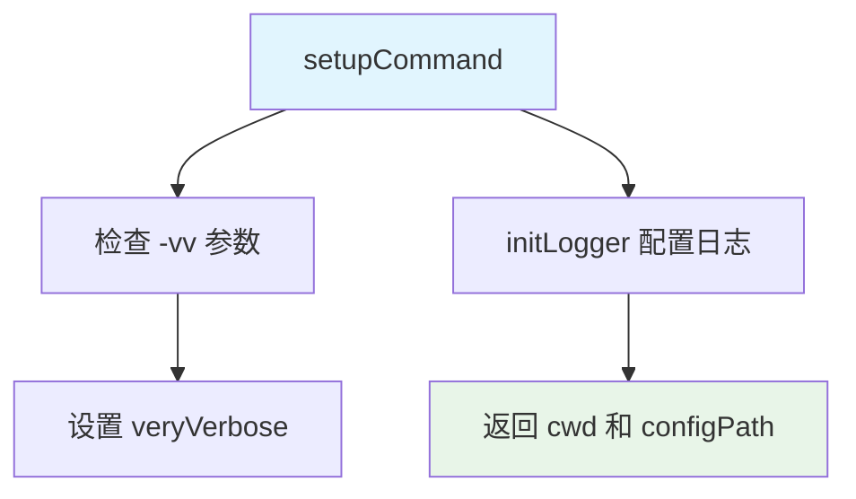
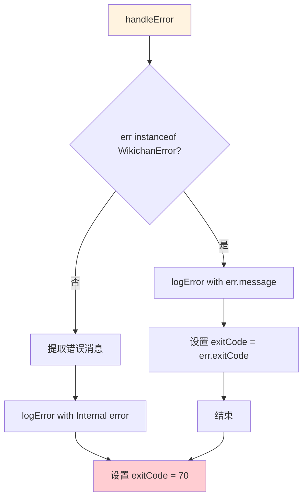
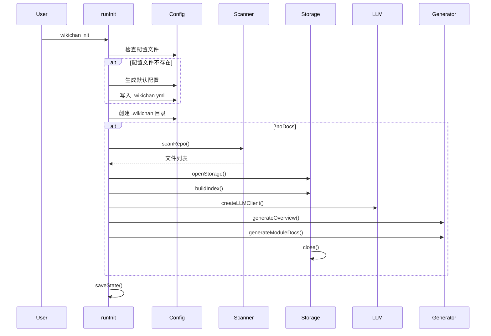
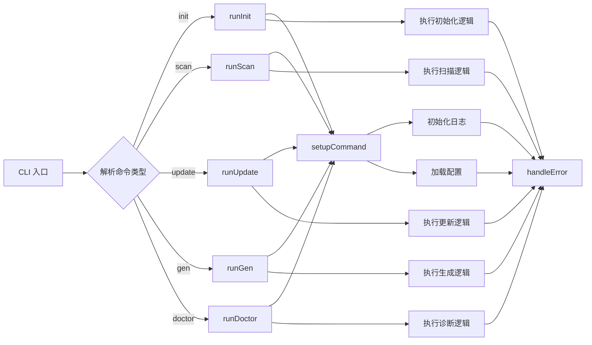
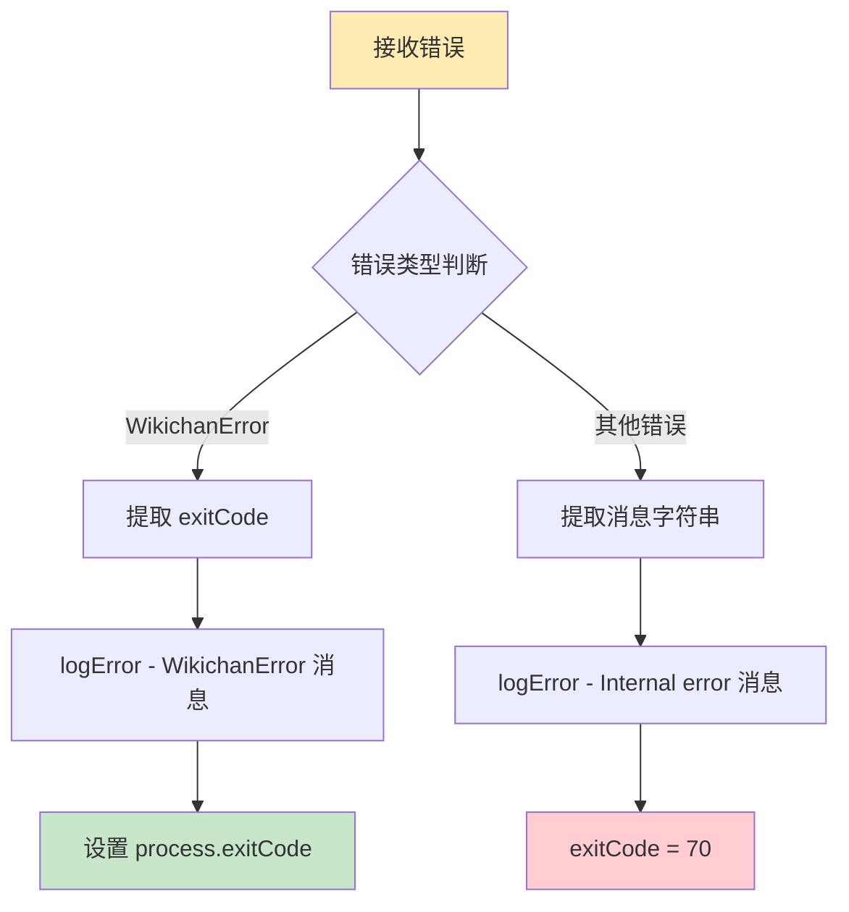

# CLI 模块文档

<cite>

**本文引用的文件**

- [src/cli/index.ts](file://src/cli/index.ts) - CLI 入口与命令注册
- [src/cli/commands/init.ts](file://src/cli/commands/init.ts) - 初始化命令
- [src/cli/commands/scan.ts](file://src/cli/commands/scan.ts) - 扫描命令
- [src/cli/commands/update.ts](file://src/cli/commands/update.ts) - 更新命令
- [src/cli/commands/gen.ts](file://src/cli/commands/gen.ts) - 文档生成命令
- [src/cli/commands/doctor.ts](file://src/cli/commands/doctor.ts) - 诊断命令

</cite>

## 目录

- [1. 简介](#1-简介)
- [2. 项目结构](#2-项目结构)
- [3. 核心组件](#3-核心组件)
- [4. 架构总览](#4-架构总览)
- [5. 详细组件分析](#5-详细组件分析)
  - [5.1 setupCommand - 命令配置初始化](#51-setupcommand---命令配置初始化)
  - [5.2 handleError - 全局错误处理](#52-handleerror---全局错误处理)
  - [5.3 runInit - 初始化命令](#53-runinit---初始化命令)
  - [5.4 runScan - 扫描命令](#54-runscan---扫描命令)
  - [5.5 runUpdate - 更新命令](#55-runupdate---更新命令)
  - [5.6 runGen - 文档生成命令](#56-rungen---文档生成命令)
  - [5.7 runDoctor - 诊断命令](#57-rundoctor---诊断命令)
- [6. 依赖分析](#6-依赖分析)
- [7. 性能考虑](#7-性能考虑)
- [8. 故障排查指南](#8-故障排查指南)
- [9. 结论](#9-结论)
- [10. 附录](#10-附录)

---

## 1. 简介

CLI 模块是 **Wikichan** 项目的命令行接口层，负责处理用户交互、命令解析和协调核心功能模块。该模块采用命令模式设计，将不同的操作（初始化、扫描、更新、生成、诊断）封装为独立的命令处理器。

### 项目目标

CLI 模块的主要目标包括：

1. **简化用户操作** - 提供直观的命令行接口，用户只需执行简单命令即可完成复杂的文档生成任务
2. **状态管理** - 维护项目状态，跟踪 Git 提交历史，实现增量更新
3. **错误处理** - 提供友好的错误提示和退出码，帮助用户快速定位问题
4. **灵活配置** - 支持多种配置选项和运行模式（干运行、静默模式等）

### 目标用户

CLI 模块面向以下用户群体：

- **开发者** - 需要自动生成代码文档的程序员
- **技术文档工程师** - 负责维护项目文档的技术写作者
- **DevOps 工程师** - 需要集成到 CI/CD 流水线的自动化脚本

### 核心价值

通过 CLI 模块，用户可以：

- 一键初始化文档生成环境
- 自动扫描代码仓库，提取符号信息
- 利用 LLM 智能生成高质量文档
- 增量更新文档，仅处理变更文件
- 诊断配置和环境问题

---

## 2. 项目结构

### 目录组织

```
src/cli/
├── index.ts              # CLI 入口，命令注册与分发
└── commands/
    ├── init.ts           # 初始化命令
    ├── scan.ts           # 扫描命令
    ├── update.ts         # 更新命令
    ├── gen.ts            # 文档生成命令
    └── doctor.ts         # 诊断命令
```

### 模块职责划分

| 文件 | 职责 | 核心功能 |
|------|------|----------|
| `index.ts` | CLI 入口点 | 命令配置初始化、全局错误处理、主命令注册 |
| `init.ts` | 项目初始化 | 生成配置文件、创建目录结构、初始扫描和文档生成 |
| `scan.ts` | 代码扫描 | 调用扫描器、构建索引、处理语言配置 |
| `update.ts` | 增量更新 | Git diff 分析、影响范围评估、增量处理 |
| `gen.ts` | 文档生成 | 调用各个文档生成器、整合 RAG 上下文 |
| `doctor.ts` | 环境诊断 | 检查配置、数据库、LLM 连接、Git 状态 |

---

## 3. 核心组件

CLI 模块由以下核心组件构成，每个组件负责特定的功能领域。

### 3.1 命令配置初始化器

**组件**: `setupCommand`

**位置**: `src/cli/index.ts:25-37`

**功能**: 初始化日志系统和工作目录配置

**参数说明**:

| 参数名 | 类型 | 必填 | 说明 |
|--------|------|------|------|
| `verbose` | `boolean` | 否 | 启用详细输出模式 |
| `quiet` | `boolean` | 否 | 静默模式，抑制所有非必要输出 |
| `logJson` | `boolean` | 否 | JSON 格式输出日志 |
| `config` | `string` | 否 | 指定配置文件路径 |
| `cwd` | `string` | 否 | 指定工作目录，默认为当前目录 |

**返回值**: `{ cwd: string, configPath: string | undefined }`



### 3.2 全局错误处理器

**组件**: `handleError`

**位置**: `src/cli/index.ts:152-161`

**功能**: 统一处理所有 CLI 级别的错误，返回适当的退出码

**错误类型处理**:

| 错误类型 | 退出码 | 处理方式 |
|----------|--------|----------|
| `WikichanError` | `err.exitCode` | 输出错误消息，保持原退出码 |
| 其他错误 | `70` (EX_SOFTWARE) | 输出 "Internal error" 消息 |



### 3.3 初始化命令

**组件**: `runInit`

**位置**: `src/cli/commands/init.ts:22-82`

**接口**: `InitOptions`

```typescript
interface InitOptions {
  force?: boolean;      // 强制覆盖已存在的配置文件
  outputDir?: string;   // 指定输出目录
  noDocs?: boolean;     // 跳过文档生成
  config?: string;      // 配置文件路径
}
```

**执行流程**:

1. 检查配置文件是否存在（除非指定 `--force`）
2. 生成默认配置文件 `.wikichan.yml`
3. 创建 `.wikichan` 目录
4. 扫描代码仓库
5. 构建索引
6. 生成文档（除非指定 `--no-docs`）
7. 保存状态到 `.wikichan/state.json`



### 3.4 扫描命令

**组件**: `runScan`

**位置**: `src/cli/commands/scan.ts:15-56`

**接口**: `ScanOptions`

```typescript
interface ScanOptions {
  languages?: string;   // 逗号分隔的语言列表
  full?: boolean;       // 全量扫描，清空现有索引
  dryRun?: boolean;     // 干运行模式
  config?: string;      // 配置文件路径
}
```

**核心流程**:

1. 加载配置文件
2. 根据 `--languages` 参数覆盖语言配置
3. 调用 `scanRepo()` 扫描仓库
4. 干运行模式下仅输出扫描信息
5. 全量模式下清空现有索引
6. 调用 `buildIndex()` 构建索引
7. 如启用 RAG，构建向量索引

### 3.5 更新命令

**组件**: `runUpdate`

**位置**: `src/cli/commands/update.ts:21-99`

**接口**: `UpdateOptions`

```typescript
interface UpdateOptions {
  from?: string;      // 起始提交哈希
  to?: string;        // 目标提交哈希，默认为 HEAD
  dryRun?: boolean;   // 干运行模式
  noDocs?: boolean;   // 跳过文档生成
  config?: string;    // 配置文件路径
}
```

**核心流程**:

1. 加载配置和状态
2. 确定变更范围（`from` 到 `to`）
3. 调用 `getChanges()` 获取 Git 差异
4. 调用 `analyzeImpact()` 分析影响范围
5. 干运行模式下输出影响分析
6. 删除索引中被删除的文件
7. 重新扫描受影响的文件
8. 重新生成受影响模块的文档
9. 更新状态文件

### 3.6 文档生成命令

**组件**: `runGen`

**位置**: `src/cli/commands/gen.ts:21-96`

**接口**: `GenOptions`

```typescript
interface GenOptions {
  type?: 'overview' | 'module' | 'api' | 'config';  // 生成类型
  module?: string;        // 指定模块名称
  outputDir?: string;     // 输出目录
  dryRun?: boolean;       // 干运行模式
  config?: string;        // 配置文件路径
}
```

**支持的生成类型**:

| 类型 | 说明 |
|------|------|
| `overview` | 项目概览文档 |
| `module` | 模块级文档（可指定 `--module`） |
| `api` | API 参考文档 |
| `config` | 配置说明文档 |

### 3.7 诊断命令

**组件**: `runDoctor`

**位置**: `src/cli/commands/doctor.ts:24-138`

**接口**: `DoctorOptions` 和 `CheckResult`

```typescript
interface DoctorOptions {
  fix?: boolean;      // 自动修复可修复的问题
  json?: boolean;     // JSON 格式输出
  config?: string;    // 配置文件路径
}

interface CheckResult {
  name: string;       // 检查项名称
  status: 'ok' | 'warning' | 'error';  // 检查状态
  message: string;    // 检查消息
}
```

**诊断检查项**:

1. **config** - 配置文件有效性
2. **directory** - `.wikichan` 目录存在性
3. **database** - SQLite 数据库完整性
4. **llm** - LLM API 连接性
5. **git** - Git 仓库检测

---

## 4. 架构总览

### 层次架构

CLI 模块采用分层架构设计，从上到下分为三个主要层次：

```mermaid
graph TB
    subgraph "表现层 Presentation Layer"
        A[用户输入]
        B[命令行参数]
    end
    
    subgraph "命令层 Command Layer"
        C[setupCommand]
        D[handleError]
        E[runInit]
        F[runScan]
        G[runUpdate]
        H[runGen]
        I[runDoctor]
    end
    
    subgraph "核心层 Core Layer"
        J[config]
        K[scanner]
        L[storage]
        M[indexer]
        N[llm]
        O[generator]
        P[state]
        Q[rag]
        R[incremental]
    end
    
    A --> B
    B --> C
    C --> D
    D --> E
    D --> F
    D --> G
    D --> H
    D --> I
    E --> J
    E --> K
    E --> L
    E --> M
    E --> N
    E --> O
    E --> P
    F --> J
    F --> K
    F --> L
    F --> M
    F --> Q
    G --> J
    G --> K
    G --> L
    G --> M
    G --> N
    G --> O
    G --> P
    G --> R
    H --> J
    H --> L
    H --> M
    H --> N
    H --> O
    H --> Q
    I --> J
    I --> L
    I --> N
    
    style "表现层 Presentation Layer" fill:#bbdefb
    style "命令层 Command Layer" fill:#c8e6c9
    style "核心层 Core Layer" fill:#ffe0b2
```

### 命令分发流程



---

## 5. 详细组件分析

### 5.1 setupCommand - 命令配置初始化

**函数签名**:
```typescript
function setupCommand(options: {
  verbose?: boolean;
  quiet?: boolean;
  logJson?: boolean;
  config?: string;
  cwd?: string
})
```

**详细分析**:

`setupCommand` 函数是 CLI 模块的初始化入口点，负责设置日志系统和解析工作目录配置。

**参数解析逻辑**:

1. **verbose** - 布尔值，控制详细输出，传递给 `initLogger`
2. **quiet** - 布尔值，静默模式，抑制输出
3. **logJson** - 布尔值，JSON 格式日志输出
4. **config** - 配置文件路径，未指定时使用默认路径
5. **cwd** - 工作目录，默认使用 `process.cwd()`

**特殊处理**:

函数会检查命令行参数中是否包含 `-vv` 标志，设置 `veryVerbose` 为 `true`。这个双 verbose 模式会输出最详细的调试信息。

**返回值结构**:

```typescript
{
  cwd: string;           // 解析后的绝对路径
  configPath: string | undefined;  // 配置文件路径
}
```

> **图表来源**: [src/cli/index.ts:25-37](file://src/cli/index.ts#L25-L37)

---

### 5.2 handleError - 全局错误处理

**函数签名**:
```typescript
function handleError(err: unknown): void
```

**错误处理策略**:



**WikichanError 退出码约定**:

| 错误类型 | 退出码 | 含义 |
|----------|--------|------|
| 配置错误 | 78 | 配置文件问题 |
| LLM 错误 | 69 | API 连接问题 |
| 内部错误 | 70 | 软件内部错误 |

> **图表来源**: [src/cli/index.ts:152-161](file://src/cli/index.ts#L152-L161)

---

### 5.3 runInit - 初始化命令

**函数签名**:
```typescript
export async function runInit(cwd: string, options: InitOptions): Promise<void>
```

**InitOptions 接口定义**:

| 属性 | 类型 | 默认值 | 说明 |
|------|------|--------|------