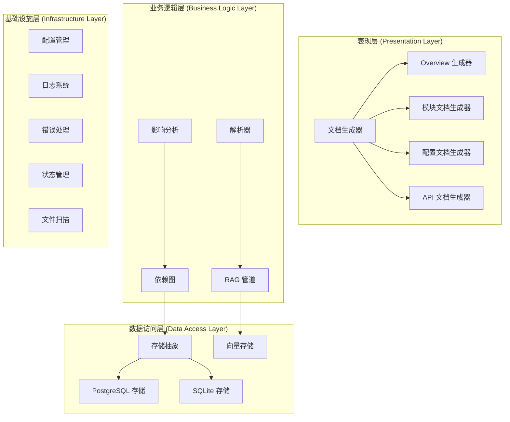
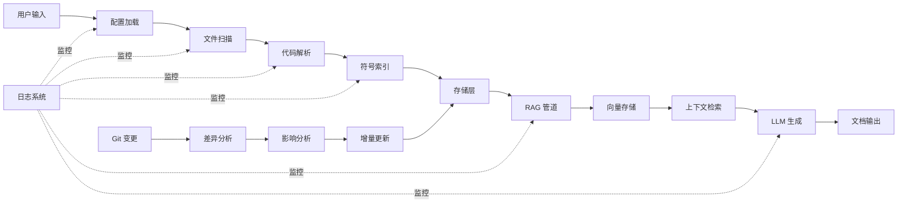
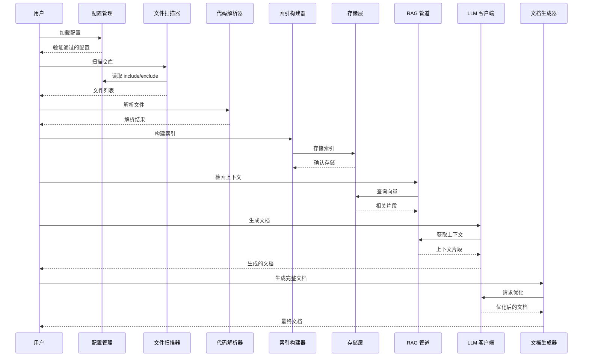
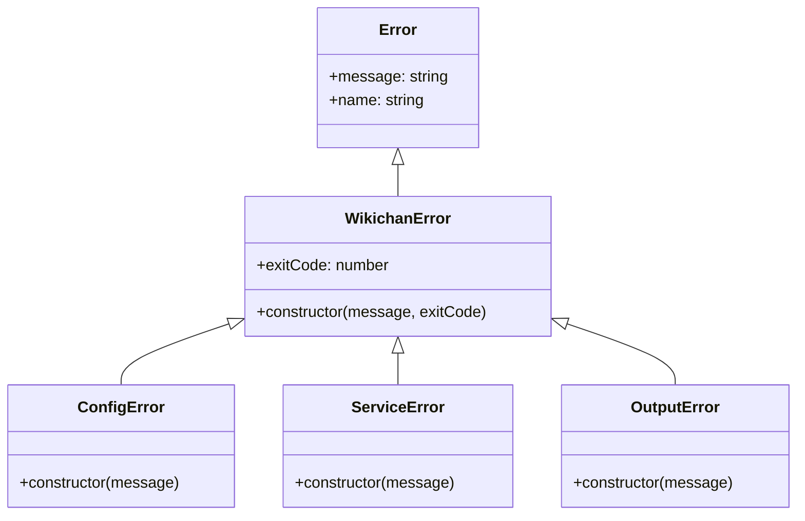

<cite>

**本文引用的文件**

- [src/core/utils.ts](file://src/core/utils.ts)
- [src/core/state.ts](file://src/core/state.ts)
- [src/core/scanner.ts](file://src/core/scanner.ts)
- [src/core/logger.ts](file://src/core/logger.ts)
- [src/core/errors.ts](file://src/core/errors.ts)
- [src/core/config.ts](file://src/core/config.ts)
- [src/core/rag/vectorStore.ts](file://src/core/rag/vectorStore.ts)
- [src/core/rag/pipeline.ts](file://src/core/rag/pipeline.ts)
- [src/core/rag/embedder.ts](file://src/core/rag/embedder.ts)
- [src/core/rag/chunker.ts](file://src/core/rag/chunker.ts)
- [src/core/parser/tsParser.ts](file://src/core/parser/tsParser.ts)
- [src/core/parser/pyParser.ts](file://src/core/parser/pyParser.ts)
- [src/core/parser/index.ts](file://src/core/parser/index.ts)
- [src/core/llm/client.ts](file://src/core/llm/client.ts)
- [src/core/llm/providers/openai.ts](file://src/core/llm/providers/openai.ts)
- [src/core/llm/providers/deepseek.ts](file://src/core/llm/providers/deepseek.ts)
- [src/core/llm/providers/claude.ts](file://src/core/llm/providers/claude.ts)
- [src/core/indexer/symbols.ts](file://src/core/indexer/symbols.ts)
- [src/core/indexer/storageFactory.ts](file://src/core/indexer/storageFactory.ts)
- [src/core/indexer/storage.ts](file://src/core/indexer/storage.ts)
- [src/core/indexer/postgresStorage.ts](file://src/core/indexer/postgresStorage.ts)
- [src/core/indexer/graph.ts](file://src/core/indexer/graph.ts)
- [src/core/incremental/impact.ts](file://src/core/incremental/impact.ts)
- [src/core/incremental/gitDiff.ts](file://src/core/incremental/gitDiff.ts)
- [src/core/generator/templates.ts](file://src/core/generator/templates.ts)
- [src/core/generator/overview.ts](file://src/core/generator/overview.ts)
- [src/core/generator/moduleDoc.ts](file://src/core/generator/moduleDoc.ts)
- [src/core/generator/configDoc.ts](file://src/core/generator/configDoc.ts)
- [src/core/generator/apiDoc.ts](file://src/core/generator/apiDoc.ts)

</cite>

---

# Wikichan Core 模块技术文档

## 目录

- [1. 简介](#1-简介)
- [2. 项目结构](#2-项目结构)
- [3. 核心组件](#3-核心组件)
- [4. 架构总览](#4-架构总览)
- [5. 详细组件分析](#5-详细组件分析)
  - [5.1 错误处理模块](#51-错误处理模块)
  - [5.2 配置管理模块](#52-配置管理模块)
  - [5.3 日志模块](#53-日志模块)
  - [5.4 状态管理模块](#54-状态管理模块)
  - [5.5 文件扫描模块](#55-文件扫描模块)
  - [5.6 工具函数模块](#56-工具函数模块)
  - [5.7 代码解析模块](#57-代码解析模块)
  - [5.8 RAG 模块](#58-rag-模块)
  - [5.9 LLM 客户端模块](#59-llm-客户端模块)
  - [5.10 索引存储模块](#510-索引存储模块)
  - [5.11 模块依赖图](#511-模块依赖图)
  - [5.12 增量处理模块](#512-增量处理模块)
  - [5.13 文档生成模块](#513-文档生成模块)
- [6. 依赖分析](#6-依赖分析)
- [7. 性能考虑](#7-性能考虑)
- [8. 故障排查指南](#8-故障排查指南)
- [9. 结论](#9-结论)
- [10. 附录](#10-附录)

---

## 1. 简介

Wikichan 是一个基于 RAG（检索增强生成）技术的代码文档智能生成工具。该 **core** 模块是整个项目的基础架构层，负责提供错误处理、配置管理、日志记录、状态持久化、代码解析、向量存储、LLM 集成、索引构建以及文档生成等核心功能。

**目标用户**：
- 开发团队需要自动生成代码文档
- 项目维护者需要跟踪代码变更影响
- 技术写作者需要生成 API 文档和技术规格说明

**核心价值**：
- 自动化代码解析和符号提取
- 智能化的文档生成（基于 LLM）
- 增量更新支持，仅处理变更文件
- 灵活的后端存储选项（SQLite、PostgreSQL）

[src/core/utils.ts:6-24](file://src/core/utils.ts#L6-L24) | [src/core/config.ts:6-43](file://src/core/config.ts#L6-L43)

---

## 2. 项目结构

Wikichan Core 模块采用分层架构设计，将核心功能划分为多个子模块：

```
src/core/
├── errors.ts              # 自定义错误类层次结构
├── config.ts              # 配置管理与验证
├── logger.ts              # 日志系统
├── state.ts               # 仓库状态持久化
├── utils.ts               # 通用工具函数
├── scanner.ts             # 文件扫描器
├── rag/                   # RAG 相关组件
│   ├── vectorStore.ts     # 向量存储（PostgreSQL/SQLite）
│   ├── embedder.ts        # 嵌入向量生成器
│   ├── chunker.ts         # 代码分块器
│   └── pipeline.ts        # RAG 处理管道
├── parser/                # 多语言代码解析器
│   ├── index.ts           # 解析器接口定义
│   ├── tsParser.ts        # TypeScript 解析器
│   └── pyParser.ts        # Python 解析器
├── llm/                   # LLM 集成
│   ├── client.ts          # LLM 客户端接口
│   └── providers/         # LLM 提供商实现
│       ├── openai.ts      # OpenAI 提供商
│       ├── deepseek.ts    # DeepSeek 提供商
│       └── claude.ts      # Claude 提供商
├── indexer/               # 代码索引
│   ├── symbols.ts         # 符号索引构建
│   ├── storage.ts         # 存储抽象层
│   ├── storageFactory.ts  # 存储工厂
│   ├── postgresStorage.ts # PostgreSQL 存储实现
│   └── graph.ts           # 模块依赖图
├── incremental/          # 增量处理
│   ├── gitDiff.ts         # Git 差异分析
│   └── impact.ts          # 变更影响分析
└── generator/             # 文档生成
    ├── templates.ts       # 提示词模板
    ├── overview.ts        # 项目概览生成
    ├── moduleDoc.ts       # 模块文档生成
    ├── configDoc.ts       # 配置文档生成
    └── apiDoc.ts          # API 文档生成
```

### 架构层次图



[src/core/generator/templates.ts:3-96](file://src/core/generator/templates.ts#L3-L96) | [src/core/rag/pipeline.ts:11-114](file://src/core/rag/pipeline.ts#L11-L114)

---

## 3. 核心组件

Wikichan Core 模块包含以下核心组件：

| 组件 | 职责 | 主要文件 |
|------|------|----------|
| **错误处理** | 提供统一的错误类层次结构 | `errors.ts` |
| **配置管理** | 配置加载、验证、合并 | `config.ts` |
| **日志系统** | 分级日志记录（TRACE/DEBUG/INFO/WARN/ERROR） | `logger.ts` |
| **状态管理** | 仓库状态持久化到 `.wikichan/state.json` | `state.ts` |
| **文件扫描** | 根据 glob 模式扫描并过滤文件 | `scanner.ts` |
| **工具函数** | 路径处理、模块名提取 | `utils.ts` |
| **代码解析** | TypeScript/Python AST 解析和符号提取 | `parser/` |
| **RAG 管道** | 嵌入生成、向量存储、相似度查询 | `rag/` |
| **LLM 客户端** | 多提供商 LLM 集成 | `llm/` |
| **索引存储** | 代码索引持久化 | `indexer/` |
| **依赖图** | 模块依赖关系构建 | `graph.ts` |
| **增量处理** | Git 差异分析、影响评估 | `incremental/` |
| **文档生成** | 基于 LLM 的文档生成 | `generator/` |

[src/core/errors.ts:1-29](file://src/core/errors.ts#L1-L29) | [src/core/config.ts:187-210](file://src/core/config.ts#L187-L210)

---

## 4. 架构总览

Wikichan Core 模块采用六边形架构（Hexagonal Architecture）设计，核心业务逻辑与外部依赖解耦。

### 数据流架构图



### 模块交互序列图



[src/core/config.ts:153-185](file://src/core/config.ts#L153-L185) | [src/core/scanner.ts:29-73](file://src/core/scanner.ts#L29-L73) | [src/core/generator/overview.ts:11-118](file://src/core/generator/overview.ts#L11-L118)

---

## 5. 详细组件分析

### 5.1 错误处理模块

错误处理模块定义了统一的错误类层次结构，支持错误分类和退出码管理。

#### 错误类层次结构



#### WikichanError 基类

```typescript
// src/core/errors.ts:1-8
export class WikichanError extends Error {
  exitCode: number;
  constructor(message: string, exitCode: number) {
    super(message);
    this.name = 'WikichanError';
    this.exitCode = exitCode;
  }
}
```

**参数说明**：
| 参数 | 类型 | 说明 |
|------|------|------|
| `message` | `string` | 错误消息 |
| `exitCode` | `number` | 程序退出码 |

#### ConfigError 类

```typescript
// src/core/errors.ts:10-15
export class ConfigError extends WikichanError {
  constructor(message: string) {
    super(message, 78);  // 退出码 78 表示配置错误
    this.name = 'ConfigError';
  }
}
```

**用途**：配置验证失败时抛出，退出码 78 符合 Debian 政策（配置问题）。

#### ServiceError 类

```typescript
// src/core/errors.ts:17-22
export class ServiceError extends WikichanError {
  constructor(message: string) {
    super(message, 1);  // 通用错误退出码
    this.name = 'ServiceError';
  }
}
```

**用途**：外部服务（如 LLM API、数据库）调用失败时抛出。

#### OutputError 类

```typescript
// src/core/errors.ts:24-29
export class OutputError extends WikichanError {
  constructor(message: string) {
    super(message, 65);  // 数据错误退出码
    this.name = 'OutputError';
  }
}
```

**用途**：输出生成失败或文件写入错误时抛出。

[src/core/errors.ts:1-29](file://src/core/errors.ts#L1-L29) | [src/core/llm/client.ts:32-56](file://src/core/llm/client.ts#L32-L56)

---

### 5.2 配置管理模块

配置管理模块负责配置加载、默认值合并、验证和类型安全。

#### WikichanConfig 接口

```typescript
// src/core/config.ts:6-43
export interface WikichanConfig {
  // 语言支持
  languages: string[];           // 支持的语言列表
  include: string[];              // glob 模式数组
  exclude: string[];             // 排除模式
  
  // 文件限制
  maxFiles?: number;             // 最大文件数限制
  
  // 解析选项
  skipGenerated?: boolean;       // 跳过生成的文件
  skipNodeModules?: boolean;      // 跳过 node_modules
  
  // 存储配置
  storage: {
    type: 'sqlite' | 'postgres';
    path?: string;               // SQLite 路径
    host?: string;               // PostgreSQL 主机
    port?: number;               // PostgreSQL 端口
    database?: string;           // 数据库名
   