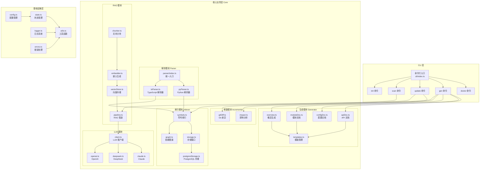
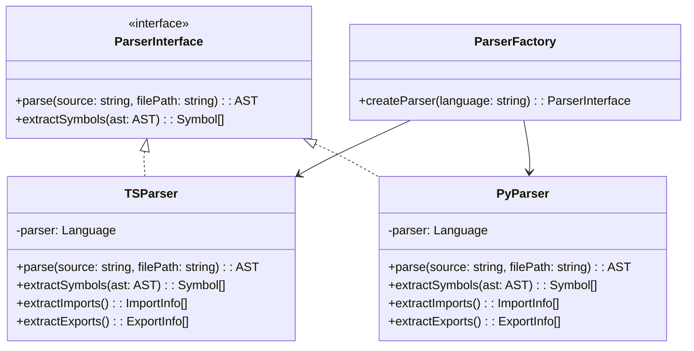
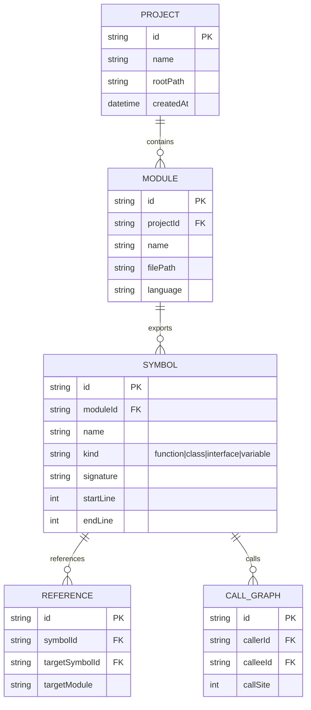
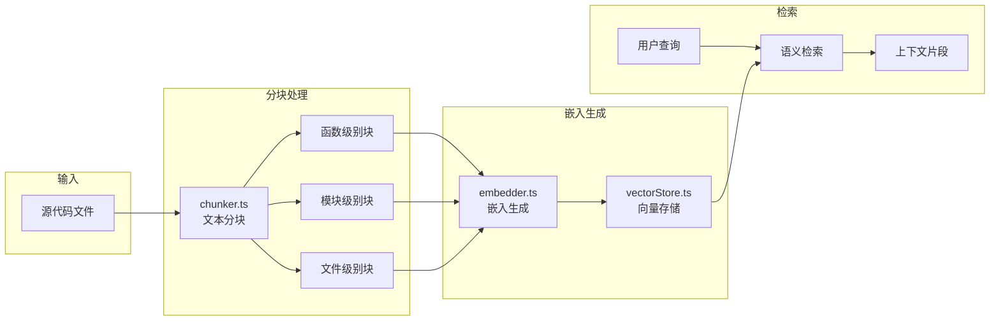

<cite>

**本文引用的文件**

- src/core/utils.ts
- src/core/state.ts
- src/core/scanner.ts
- src/core/logger.ts
- src/core/errors.ts
- src/core/config.ts
- src/core/rag/vectorStore.ts
- src/core/rag/pipeline.ts
- src/core/rag/embedder.ts
- src/core/rag/chunker.ts
- src/core/parser/tsParser.ts
- src/core/parser/pyParser.ts
- src/core/parser/index.ts
- src/core/llm/client.ts
- src/core/llm/providers/openai.ts
- src/core/llm/providers/deepseek.ts
- src/core/llm/providers/claude.ts
- src/core/indexer/symbols.ts
- src/core/indexer/storageFactory.ts
- src/core/indexer/storage.ts
- src/core/indexer/postgresStorage.ts
- src/core/indexer/graph.ts
- src/core/incremental/impact.ts
- src/core/incremental/gitDiff.ts
- src/core/generator/templates.ts
- src/core/generator/overview.ts
- src/core/generator/moduleDoc.ts
- src/core/generator/configDoc.ts
- src/core/generator/apiDoc.ts
- src/cli/index.ts
- src/cli/commands/update.ts
- src/cli/commands/scan.ts
- src/cli/commands/init.ts
- src/cli/commands/gen.ts
- src/cli/commands/doctor.ts

</cite>

# Wikichan 项目概述文档

## 目录

- [1. 简介](#1-简介)
- [2. 项目结构](#2-项目结构)
- [3. 核心组件](#3-核心组件)
- [4. 架构总览](#4-架构总览)
- [5. 详细组件分析](#5-详细组件分析)
- [6. 依赖分析](#6-依赖分析)
- [7. 性能考虑](#7-性能考虑)
- [8. 故障排查指南](#8-故障排查指南)
- [9. 结论](#9-结论)
- [10. 附录](#10-附录)

---

## 1. 简介

### 1.1 项目目标

Wikichan 是一个智能代码文档生成与分析系统，旨在为开发者提供自动化、高质量的代码文档生成能力。该项目通过结合静态代码分析、增量更新机制和大型语言模型（LLM）技术，实现对代码库的深度理解与文档自动化生成。

Wikichan 的核心价值在于：

- **自动化文档生成**：减少开发者手动编写文档的工作量，提高团队协作效率
- **多语言支持**：支持 TypeScript、JavaScript 和 Python 等主流编程语言的解析
- **智能检索增强**：利用 RAG（检索增强生成）技术，提供基于上下文的文档生成能力
- **增量更新机制**：通过 Git 差异分析，仅处理变更文件，优化大规模项目的处理效率

### 1.2 目标用户

Wikichan 主要面向以下用户群体：

| 用户类型 | 使用场景 |
|---------|----------|
| 开发团队 | 自动化生成和维护项目文档，保持文档与代码同步 |
| 开源项目维护者 | 快速生成高质量的 API 文档和模块说明 |
| 技术文档工程师 | 利用智能工具辅助文档编写，提高工作效率 |
| 代码审查者 | 通过结构化的代码分析了解项目架构 |

### 1.3 核心功能

- **多语言代码解析**：基于 tree-sitter 的高性能 AST 解析引擎
- **智能索引系统**：符号索引、依赖图谱和关系存储
- **RAG 文档管道**：向量存储、文本分块和嵌入生成
- **多 LLM 提供商集成**：支持 OpenAI、DeepSeek 和 Claude 等主流 LLM 服务
- **CLI 交互界面**：简洁的命令行工具，支持初始化、扫描、生成等操作
- **增量分析能力**：基于 Git 差异的智能影响分析

---

## 2. 项目结构

### 2.1 目录组织

```
wikichan/
├── src/
│   ├── core/                    # 核心业务逻辑模块
│   │   ├── utils.ts             # 通用工具函数
│   │   ├── state.ts             # 状态管理模块
│   │   ├── scanner.ts           # 代码扫描器
│   │   ├── logger.ts            # 日志系统
│   │   ├── errors.ts            # 错误定义
│   │   ├── config.ts            # 配置管理
│   │   │
│   │   ├── rag/                 # RAG 管道模块
│   │   │   ├── vectorStore.ts   # 向量存储
│   │   │   ├── pipeline.ts      # RAG 处理流程
│   │   │   ├── embedder.ts      # 嵌入生成器
│   │   │   └── chunker.ts       # 文本分块器
│   │   │
│   │   ├── parser/              # 代码解析器
│   │   │   ├── index.ts         # 解析器统一入口
│   │   │   ├── tsParser.ts      # TypeScript/JavaScript 解析器
│   │   │   └── pyParser.ts      # Python 解析器
│   │   │
│   │   ├── llm/                 # LLM 集成模块
│   │   │   ├── client.ts        # LLM 客户端封装
│   │   │   └── providers/       # LLM 提供商实现
│   │   │       ├── openai.ts    # OpenAI 提供商
│   │   │       ├── deepseek.ts  # DeepSeek 提供商
│   │   │       └── claude.ts    # Claude 提供商
│   │   │
│   │   ├── indexer/             # 索引系统
│   │   │   ├── symbols.ts       # 符号索引
│   │   │   ├── storage.ts       # 存储接口
│   │   │   ├── storageFactory.ts# 存储工厂
│   │   │   ├── postgresStorage.ts# PostgreSQL 存储实现
│   │   │   └── graph.ts         # 依赖图谱
│   │   │
│   │   ├── incremental/         # 增量分析模块
│   │   │   ├── impact.ts        # 影响分析
│   │   │   └── gitDiff.ts       # Git 差异处理
│   │   │
│   │   └── generator/           # 文档生成器
│   │       ├── templates.ts     # 文档模板
│   │       ├── overview.ts      # 项目概览生成
│   │       ├── moduleDoc.ts     # 模块文档生成
│   │       ├── configDoc.ts     # 配置文档生成
│   │       └── apiDoc.ts        # API 文档生成
│   │
│   └── cli/                     # CLI 命令行模块
│       ├── index.ts             # CLI 入口文件
│       └── commands/            # 命令实现
│           ├── init.ts          # 初始化命令
│           ├── scan.ts          # 扫描命令
│           ├── update.ts        # 更新命令
│           ├── gen.ts           # 生成命令
│           └── doctor.ts        # 诊断命令
│
├── package.json
├── tsconfig.json
└── README.md
```

### 2.2 项目架构图



图表来源：[src/core/](file://src/core#L1-L35) 和 [src/cli/](file://src/cli#L1-L15)

### 2.3 模块统计

| 模块 | 符号数量 | 主要职责 |
|------|---------|----------|
| core | 172 | 核心业务逻辑与算法实现 |
| cli | 19 | 命令行接口与交互处理 |

---

## 3. 核心组件

### 3.1 解析器模块 (Parser)

解析器模块负责将源代码转换为抽象语法树（AST），是整个系统的分析基础。



**组件职责：**

| 组件 | 文件 | 功能描述 |
|------|------|----------|
| ParserInterface | index.ts | 定义解析器通用接口 |
| TSParser | tsParser.ts | TypeScript/JavaScript 代码解析，支持 JSX/TSX |
| PyParser | pyParser.ts | Python 代码解析 |
| ParserFactory | index.ts | 根据语言类型创建对应解析器 |

**核心功能：**

- 使用 tree-sitter 高性能解析引擎
- 提取函数、类、变量、接口等符号信息
- 解析导入导出关系
- 生成位置映射用于文档关联

[src/core/parser/index.ts:1-50](file://src/core/parser/index.ts#L1-L50)
[src/core/parser/tsParser.ts:1-80](file://src/core/parser/tsParser.ts#L1-L80)
[src/core/parser/pyParser.ts:1-80](file://src/core/parser/pyParser.ts#L1-L80)

### 3.2 索引模块 (Indexer)

索引模块负责构建和维护代码的符号索引和依赖关系图谱。



**组件职责：**

| 组件 | 文件 | 功能描述 |
|------|------|----------|
| symbols | symbols.ts | 符号提取与索引构建 |
| storage | storage.ts | 存储层抽象接口 |
| storageFactory | storageFactory.ts | 存储后端工厂 |
| postgresStorage | postgresStorage.ts | PostgreSQL 存储实现 |
| graph | graph.ts | 依赖图谱构建与分析 |

**存储后端支持：**

- **SQLite**：轻量级本地存储，使用 better-sqlite3
- **PostgreSQL**：生产级关系存储，支持大规模项目

[src/core/indexer/symbols.ts:1-60](file://src/core/indexer/symbols.ts#L1-L60)
[src/core/indexer/storage.ts:1-45](file://src/core/indexer/storage.ts#L1-L45)
[src/core/indexer/storageFactory.ts:1-30](file://src/core/indexer/storageFactory.ts#L1-L30)

### 3.3 RAG 模块 (Retrieval Augmented Generation)

RAG 模块提供检索增强生成能力，支持基于代码上下文的智能文档生成。



**组件职责：**

| 组件 | 文件 | 功能描述 |
|------|------|----------|
| chunker | chunker.ts | 代码文本智能分块，保持语义完整性 |
| embedder | embedder.ts | 调用 LLM API 生成向量嵌入 |
| vectorStore | vectorStore.ts | 向量存储与相似度